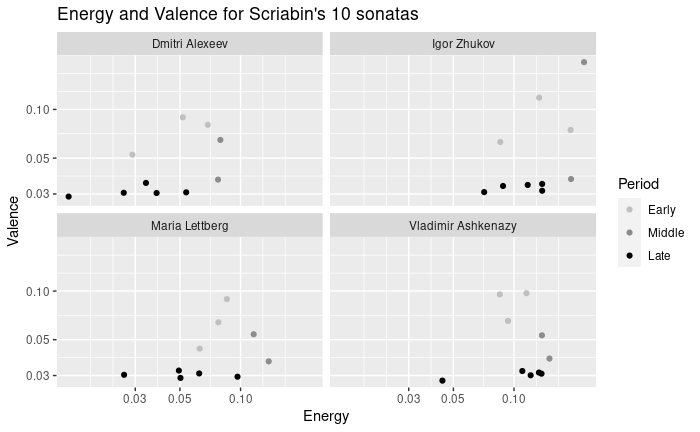
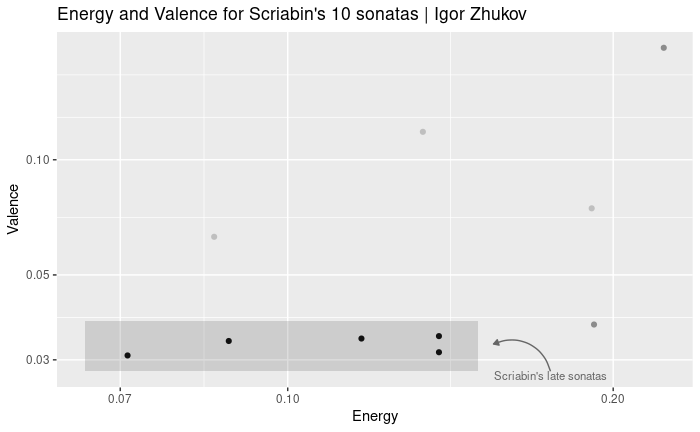

# Compmus-portfolio

There are many composers who have made a name for themselves when it comes to their contribution to the piano repertoire. One such composer is Alexander Scriabin. However, what seperates him from other composers of similar regard, is the way in which his musical language has developed throughout his life. The influence of Frederic Chopin and other romantic composers can clearly be discerned at the start of his carreer. In spite of that, his music would increasingly veer away from traditional harmony and tonality over the turn of the 20th century. Much like Arnold Schoenberg, he had developed a unique, modernist style of music that would influence many other 20th century composers.

One of my goals is to examine wether Scriabin's changing style could be accurately represented. This development is perhaps best reflected in Scriabin's 10 piano sonatas, which span the majority of his composing carreer. My corpus therefore consists of recordings of these sonatas by four pianists, namely Vladimir Ashkenazy, Maria Lettberg, Igor Zhukov and Dmitri Alexeev. These pieces, much like his other works, leave the performer with room for their own interpretation. So It would perhaps also be interesting to see in what capacity spotify could measure the difference between performers.

When considering tracks of particular interest, the 4th and 5th piano sonatas come to mind. The former being one of his first pieces to display a concrete change in style, and the later being one of the first stepts into truly new territory. Yet despite their differences they do both have a distinct touch of lightness that is in my opinion more difficult to find in his other sonatas. A further look into these pieces may yield intriguing results.

## Example plots

-  The figure above displays the energy and valence levels for the 10 sonatas of each performer. The sonatas have been categorized in those belonging to Scriabin's early (1-3), middle (4-5) and late (6-10) period. Since Scriabin's first four sonatas are comprised of multiple parts/movements and are als recorded as such, the mean energy and valence of each those sonatas is used here.

-  The above figure displays the energy and valence levels for Igor Zhukov's recordings of the sonatas.

